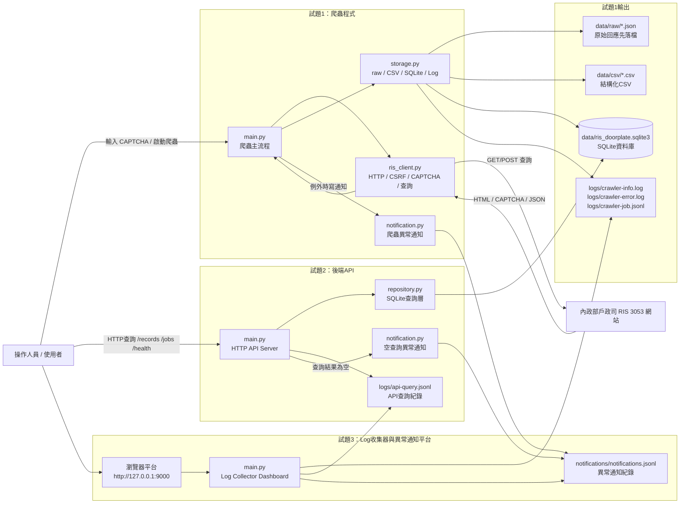
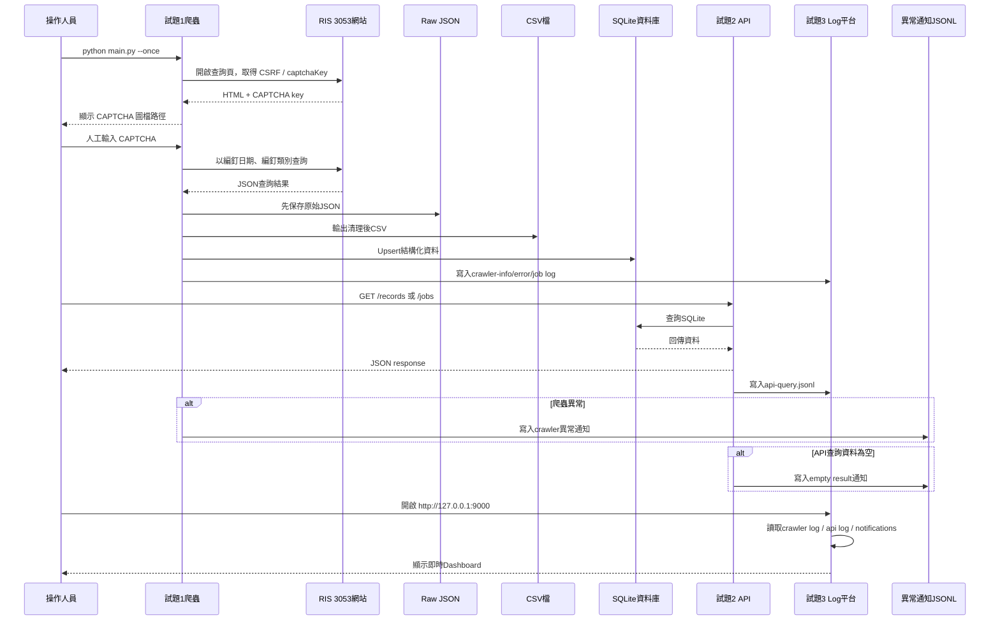
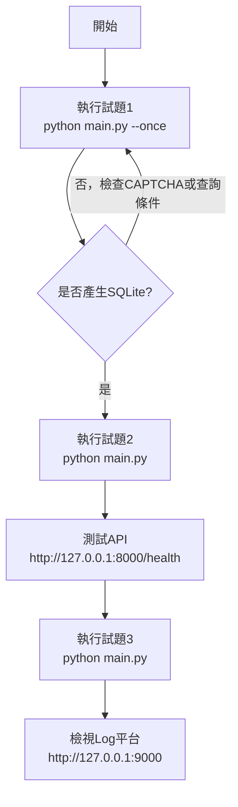
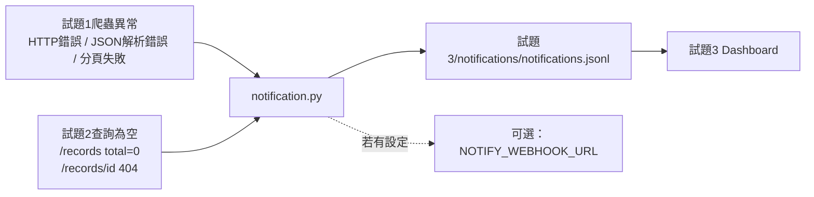

# 試題4：系統架構圖

本文件繪製試題1、試題2、試題3的整體系統架構，說明爬蟲、資料庫、API、Log 收集器與異常通知之間的關係。

## 一、整體系統架構圖



## 二、資料流架構圖



## 三、元件職責說明

| 試題 | 元件 | 職責 |
| --- | --- | --- |
| 試題1 | `main.py` | 爬蟲入口、排程、分頁查詢、人工 CAPTCHA 流程 |
| 試題1 | `ris_client.py` | 維持 Cookie、取得 CSRF、下載 CAPTCHA、送出查詢 POST |
| 試題1 | `storage.py` | raw JSON 落檔、CSV輸出、SQLite建表與upsert、job log |
| 試題1 | `notification.py` | 爬蟲異常時寫入試題3通知檔，可選 webhook |
| 試題2 | `main.py` | 提供 `/health`、`/records`、`/records/{id}`、`/jobs` API |
| 試題2 | `repository.py` | 封裝 SQLite 查詢與條件組合 |
| 試題2 | `notification.py` | 查詢結果為空時寫入異常通知 |
| 試題3 | `main.py` | Log Dashboard 與 JSON API，讀取試題1/2 log 與通知 |
| 試題4 | `系統架構圖.md` | 說明整體系統架構、資料流與部署方式 |

## 四、部署 / 執行關係



## 五、異常通知設計



通知採 JSONL 格式，每行一筆事件，包含：

```json
{
  "created_at": "2026-06-09T00:00:00+00:00",
  "service": "試題1爬蟲",
  "severity": "error",
  "event_type": "crawler_page_failed",
  "message": "爬蟲分頁任務失敗",
  "details": {}
}
```

## 六、設計重點

1. **先落檔再入庫**：試題1先保存 raw JSON，再輸出 CSV，最後寫 SQLite，方便追查與重跑解析。
2. **資料服務分層**：試題2 API 不直接爬網站，只讀取試題1產生的 SQLite。
3. **監控獨立化**：試題3獨立讀 log 與 notification，不影響爬蟲/API 主流程。
4. **異常可追蹤**：爬蟲失敗、API空查詢都會寫入 JSONL 通知紀錄。
5. **標準庫實作**：所有試題皆使用 Python 標準庫，Windows 可直接執行。
